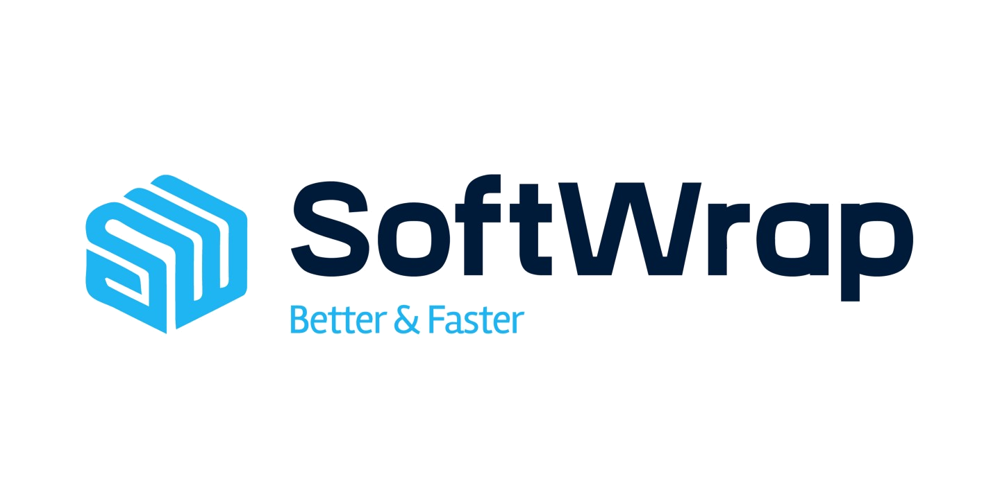

<h1 align="center">
    
</h1>

<h2 align="center"> 
	🗒️ Processo Seletivo
</h2>

<h2 align="center">
    
[Projeto](https://github.com/BrunoNishimura/Processo-Seletivo_Softwrap) |
[Front-End](https://github.com/BrunoNishimura/Processo-Seletivo_Softwrap/tree/main/frontend) | [Back-End](https://github.com/BrunoNishimura/Processo-Seletivo_Softwrap/tree/main/backend) | [Site](https://softwrap-backend.web.app/)
</h2>

## 💻 Descrição do Front-end

Realizar uma aplicação Front-End e Back-End, que possua uma tabela e seja possível as seguintes ações:

1. Inserir conteúdo na tabela.
2. Editar o conteúdo da tabela.
3. Remover conteúdo da tabela.
4. Paginar a tabela (Pode ser realizado no front-end).
5. Visualizar de forma clara os dados apresentados.


## :information_source: Como usar?

To clone and run this application, you'll need [Git](https://git-scm.com), [Node.js][nodejs] + [Yarn][yarn] installed on your computer.

### Install Front-end
From your command line:
```bash
# Clone this repository
$ git clone https://github.com/BrunoNishimura/Processo-Seletivo_Softwrap.git

# Go into the repository
$ cd Processo-Seletivo_Softwrap/

# Install dependencies
$ npm install

# Run
$ npm start

# running on port 3000
```
